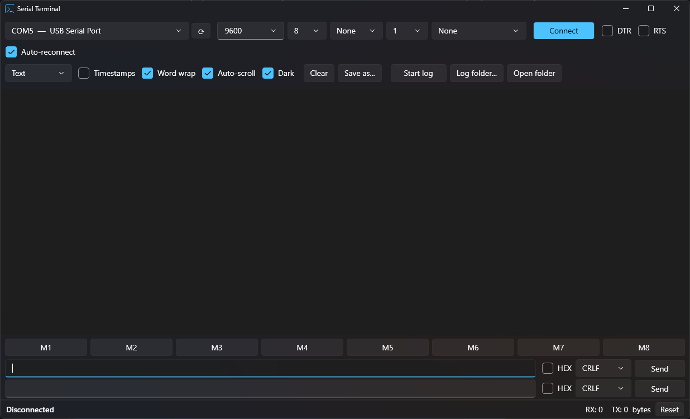
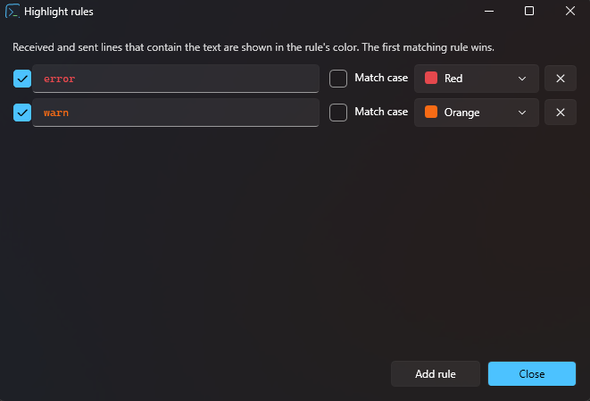

# Serial Terminal

A free, open-source serial port (COM) terminal for Windows. It is built for everyday work with microcontrollers such as STM32, Arduino and ESP32.

It was written because the existing tools were either paid, hard to read, or limited, for example by a fixed line length or by not being able to log to a file and watch the output at the same time.

**Website:** https://kod47.github.io/serial-terminal/



## Features

**Display**
- No line-length limit. Word wrap is optional, with horizontal scrolling when it is off.
- Large, readable monospace font. Zoom with **Ctrl + mouse wheel** or **Ctrl +/−**.
- Dark and light themes.
- Separate colors for received data (RX), sent data (TX), info messages and errors.
- Optional timestamps with millisecond precision.
- Four display modes: **Text**, **HEX**, **HEX + ASCII** and **Modbus RTU**. The HEX modes start a new line after an idle gap, so each packet shows up on its own line.
- Control characters stay visible (␀ ␛ …) instead of disappearing.
- A buffer of 100,000 lines. Auto-scroll pauses when you scroll up and resumes when you scroll back to the bottom.
- Select lines and press **Ctrl + C** to copy them.

**Keyword highlighting and filter**
- Lines that contain a keyword are colored, for example `error` in red and `warn` in orange. See [below](#highlight-rules).
- **Filter** (Ctrl+F) shows only the lines that contain a given text.

**Several ports at once**
- Each port opens in its own tab (**Ctrl+T**). Every tab has its own settings, output, log and graph.
- A colored dot on each tab shows whether it is connected, waiting to reconnect or disconnected.

**Logging**
- **Start log** (Ctrl+L) writes to a file while you keep monitoring.
- File names are generated automatically, for example `COM5_2026-09-24_14-30-00.log`. You choose the folder.
- **Save as...** (Ctrl+S) saves everything currently on screen.

**Connection**
- Port list with device names, for example "STMicroelectronics Virtual COM Port". It updates automatically when USB devices are plugged in or removed.
- Any baud rate, including custom values. Data bits, parity, stop bits and flow control are configurable.
- Manual DTR and RTS control.
- **Auto-reconnect** after the board is reset or the cable is unplugged.

**Sending**
- Two independent send lines, each with its own text or HEX mode and line ending (None, CR, LF or CRLF).
- **Repeat** sends a line periodically, every 10 ms or more. Useful for polling.
- The text stays in the box after sending. **Enter** sends, **Up/Down** browses the history.
- 8 macro buttons: left-click sends, right-click edits.
- HEX input accepts `01 03 00 0A`, `01030A` or `0x01,0x03`.
- **Send file** with adjustable chunk size, a delay between chunks and a progress bar.

**Modbus RTU**
- Each frame is decoded: slave, function, addresses and values, exceptions, and a CRC check.
  ```
  01 03 00 00 00 0A C5 CD  [Slave 1 · Read Holding Registers · start 0, count 10 · CRC OK]
  ```
- **+CRC** appends the CRC16 to HEX data automatically. Type `01 03 00 00 00 0A` and the CRC is added when the frame is sent.

**Live graph**
- Numbers in received lines are plotted in real time. `temp=23.5 hum=40` gives named series, and `12 34 56` gives series #1, #2, #3.
- The time window can be 10 s to 5 min. The Y axis scales automatically (optionally always including 0) or uses a manual Min/Max.

**Interface**
- Full menu (File, Edit, Connection, View, Tools, Help) with keyboard shortcuts.
- Each toolbar can be shown or hidden from **View → Toolbars**.

All settings are saved automatically to `%AppData%\SerialTerminal\settings.json`.

## Highlight rules

Few serial terminals can do this. You set keywords and colors once, and every received or sent line that contains a keyword stands out immediately. You no longer need to search through thousands of lines for an error.



- Open it from **Tools → Highlight rules...** or with the **Highlight...** button.
- Each rule has an on/off switch, the text to look for, an optional **Match case** setting and a color.
- The first matching rule sets the line's color. The rules apply to all tabs, including lines that are already on screen.
- Combine it with the **Filter** to show only the lines you care about.

## Download

**[⬇ Download SerialTerminal.exe](https://drive.google.com/file/d/1hD2M1zEcryQRRnBcadSvXEkPlYDsIwL9/view?usp=drive_link)** (v0.2.0, Windows 10/11 x64, ~62 MB)

No installation needed: download the file and run it. It does not require .NET.

Google Drive may warn that it cannot scan a file this large for viruses. Choose **Download anyway**. Windows SmartScreen may also warn about an unknown publisher. Click **More info → Run anyway**.

## Build from source

Requires the [.NET 10 SDK](https://dotnet.microsoft.com/download).

```
git clone https://github.com/kod47/serial-terminal.git
cd serial-terminal
dotnet run
```

### Standalone .exe

This creates a single `SerialTerminal.exe` that runs without installing .NET:

```
dotnet publish -c Release -r win-x64 --self-contained true -p:PublishSingleFile=true -p:IncludeNativeLibrariesForSelfExtract=true
```

The output is in `bin\Release\net10.0-windows\win-x64\publish\`.

## Project structure

| Path | Purpose |
|---|---|
| `Core/SerialConnection.cs` | Opening the port and the background read loop |
| `Core/LineAssembler.cs` | Turns raw bytes into display lines (Text/HEX/Modbus) |
| `Core/ModbusRtu.cs` | Modbus RTU CRC and frame decoder |
| `Core/HighlightRule.cs` | Keyword highlighting |
| `Core/GraphData.cs` | Extracts numeric values for the graph |
| `Core/PortEnumerator.cs` | Port list with device descriptions (WMI) |
| `Core/LogWriter.cs` | Logging to file |
| `Core/AppSettings.cs` | Settings persisted to JSON |
| `MainViewModel.cs` | Tabs, shared port list, global options |
| `SessionViewModel.cs` | One tab: port, output, sending, log, graph |
| `ChartControl.cs` | Live chart |
| `MainWindow.xaml`, `SessionView.xaml` | User interface (WPF, Fluent theme) |

## Contributing

Bug reports, ideas and pull requests are welcome.

## Support the project

This program is free. If it saves you time and you would like to support further development, you can make a donation via **PayPal** to:

**kod447@gmail.com**

Thank you!

## License

[MIT](LICENSE): free to use, modify and distribute, including commercially.
